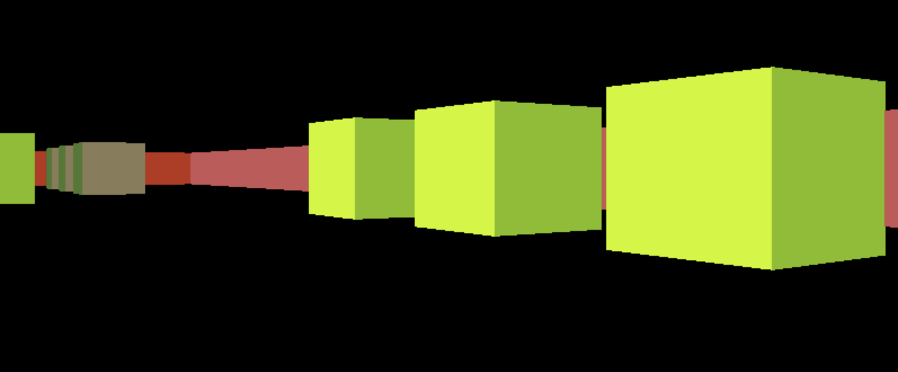

# Wolf3D

This is a simple Wolfenstein 3D-like raycasting engine I created as a class project back in 2016.

## Usage

```
./wolf3d map.txt [options]
```

eg.
```
./wolf3d map.txt --width 800 --height 600 --vsync
```

### Options

*   `--width <width>`: Set the window width (default: 1920).
*   `--height <height>`: Set the window height (default: 1080).
*   `--vsync`: Enable VSync.

## Screenshot



## Reference

<https://lodev.org/cgtutor/raycasting.html>
